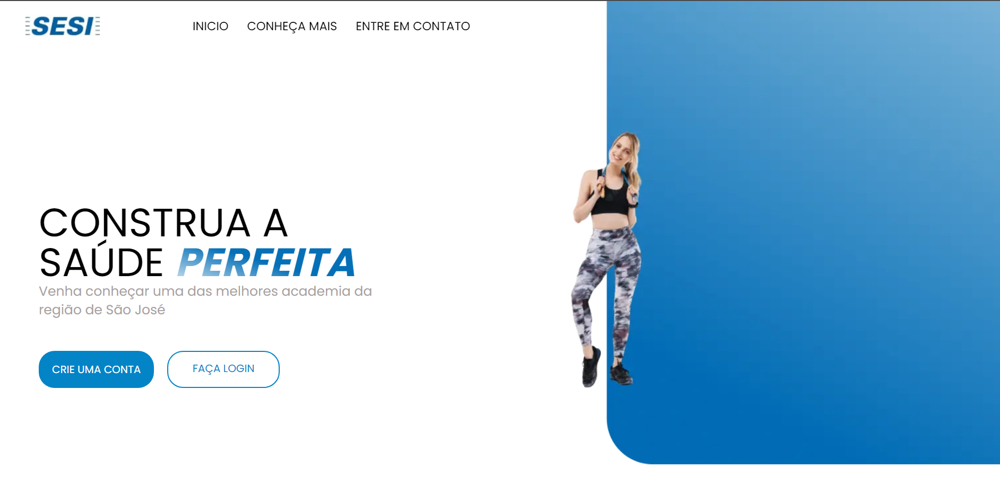

# Academia Sesi

> Site Academia Sesi (Home page)

Projeto construído para a SA (situação de aprendizagem) do 2° do ensino médio.

[🔗 Clique aqui para acessar o site](https://app-academia.vercel.app/)

## 🛠️ Tecnologias 

- HTML
- CSS
- JavaScript
- Nextjs
- Git e Github

## 👥 Alunos

- Nicole Licyane
- Gustavo Braga
- Pedro Dias
- Pedro Henrique
- Rodrigo Xavier

## ✉️ Contato

nicole_lv_silva@estudante.sesisenai.org.br
gustavo_s_braga@estudante.sesisenai.org.br
pedro_sartorio@estudante.sesisenai.org.br
pedro_hc_nunes@estudante.sesisenai.org.br
rodrigo_marcondes@estudante.sesisenai.org.br